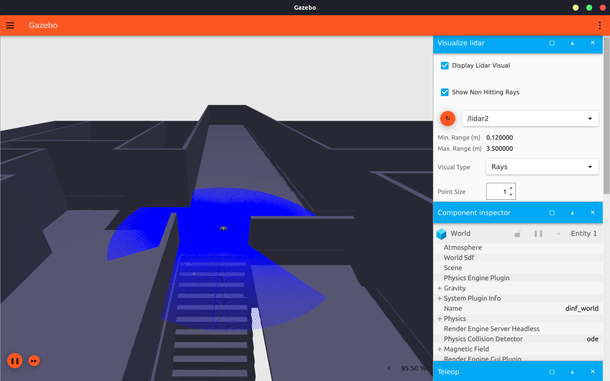

# Simulação do Turtlebot3 no ambiente do Dinf UFPR

**O mapa do dinf utilizado aqui foi feito pela Leticia Fontanelli e pelo Vinicius Tikara**
## Requisitos 

- ROS2 Humble
- Ubuntu Jammy
- Gazebo Ignition (`ign gazebo`)

## To-do

- [ ] Criar launch file?
- [ ] Lançar o Rviz junto com a simulação
- [ ] Adicionar objetos na mundo?
- [ ] Melhorar os parâmetros da física do turtlebot?
- [ ] Descobrir o por que de a mudança do max_step_size no GUI do gazebo não estar funcionando
- [x] Trocar o lidar com ray para o gpu_lidar
- [x] Adicionar a estrutura do Dinf no mundo
- [x] Mudar as cores do Turtlebot (ambient diffuse specular emissive)
- [x] Configurar diff driver plugin
- [x] Ajustar posição de inicialização do turtlebot no mundo

## Como rodar a simulação

Adicione essas linhas no seu `.bashrc`. Adicione o caminho correto para o dinf_world no export e rode um `source ~/.bashrc`.

`source /usr/share/colcon_argcomplete/hook/colcon-argcomplete.bash`

`source /opt/ros/humble/setup.bash`

`source ~/Documents/ROS2/turtlebot_ws/install/setup.bash`

`export IGN_GAZEBO_RESOURCE_PATH="$HOME/caminho/para/o/arquivo/simulacao-Turtlebot3/gazebo/dinf_world"`

Na pasta /dinf_world rode o comando `ign gazebo -v -r dinf_world.sdf`, você deverá ver a seguinte tela:

No início, o Lidar não estará visível. Para fazer com que o gazebo escute o tópico do Lidar, clique no botão laranja em "Visualize Lidar". Para movimentar o Turtlebot, utilize o teleop que está na mesma aba, à direita.

## Anotações

- installar o `sudo apt install ros-humble-turtlebot3`
